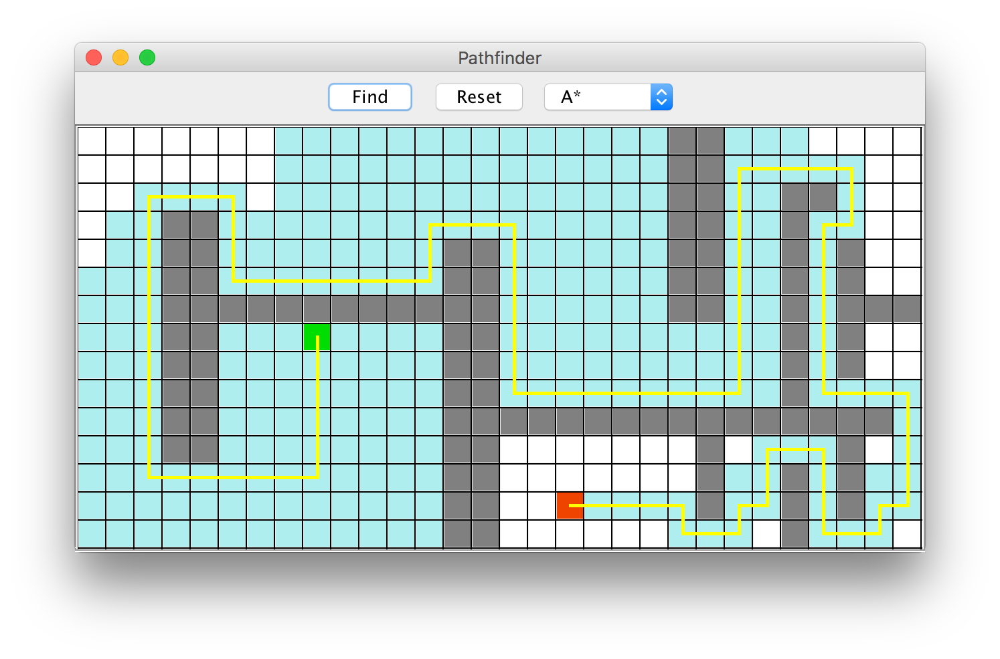

# Design document

Pathfinder is a collection of shortest path algorithms for grid-based maps. It can be used in a visualization mode to illustrate the application of individual algorithms, or in a benchmarking mode to compare the performance of different algorithms.

## Algorithms and data structures

The intent is to implement a few shortest path algorithms. The basic algorithms to be implemented include Dijkstra and A*. These are well documented in the course notes and a number of other sources. In addition, one more complex algorithm needs to be implemented. The alternatives include D* and Jump point search (JPS). Of these two, Jump point search seems more promising. It provides a significant speedup compared to standard A*, and is geared towards game-like maps. Based on a brief reading, D* seems more optimized towards applications where the pathfinding algorithm is invoked repeatedly. Also, Jump point search seems to have more documentation available.

The running time of Dijkstra and A* is O((E + V) log V). This is true when the priority queue is implemented using a binary heap. Since Jump point search is an optimized version of A* it probably has the same worst-case running time. In practice, Dijkstra is slower than A*, and A* is slower than JPS. Jump point search can reduce the running time of A* by an order of magnitude. The space complexity of Dijkstra and A* is O(V).

The data structures required are binary heaps and dynamic arrays.

## Description of the program

Visualization mode enables the user to study the results of running an algorithm on a particular grid.

Usage of the visualization mode can be described in three steps. First, the user can either draw a new grid with the mouse, or load an existing grid from disk. This includes placement of the source and destination nodes. Second, the user chooses which algorithm to execute. Third, after execution finishes, the program displays all the visited nodes and a shortest path. This final step is described in the picture below.

Inputs in the visualization mode include a grid-based map, placement of the source and destination nodes and selection of the algorithm. Ouputs include a result grid which displays visited nodes and a shortest path.

It should be noted that the visualization mode displays the final stage of running the algorithm, but not the intermediate steps. Simulation of the intermediate steps of the algorithm would be a nice feature, but it probably won't be implemented.

Benchmarking mode enables one to run experiments which compare the various algorithms on different grid-based maps. The key feature of the benchmarking mode is that - as opposed to just one problem - it solves a specified sequence of shortest path problems. This sequence will most likely be specified as a CSV file.

The intention is to use some of the benchmarks at [movingai.com/benchmarks](https://www.movingai.com/benchmarks/).

Inputs in the benchmark mode include a set of grid-based maps and a CSV file. The CSV file specifies which problems to solve. Ouputs include summary data printed to the console, and possibly a CSV file with more detailed information.

Whereas the visualization mode is implemented as a graphical user interface (GUI) the benchmarking mode is a command-line interface (CLI).

## References

1. Kivinen, Jyrki (2018), "Tietorakenteet ja algoritmit, Kevät 2018"
2. https://en.wikipedia.org/wiki/D*
3. https://en.wikipedia.org/wiki/Jump_point_search
4. https://zerowidth.com/2013/05/05/jump-point-search-explained.html
5. http://theory.stanford.edu/~amitp/GameProgramming/Variations.html
6. Stentz, Anthony (1994), "Optimal and Efficient Path Planning for Partially-Known Environments", Proceedings of the International Conference on Robotics and Automation: 3310–3317
7. Koenig, S.; Likhachev, M.; Furcy, D. (2004), "Lifelong Planning A*", Artificial Intelligence Journal, 155 (1–2): 93–146
8. Harabor, D.; Grastien, A. (2011), "Online Graph Pruning for Pathfinding on Grid Maps", 25th National Conference on Artificial Intelligence, AAAI.
