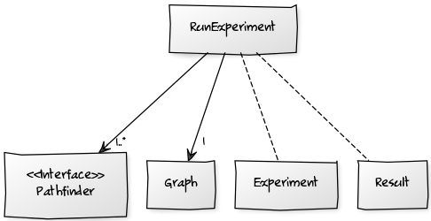
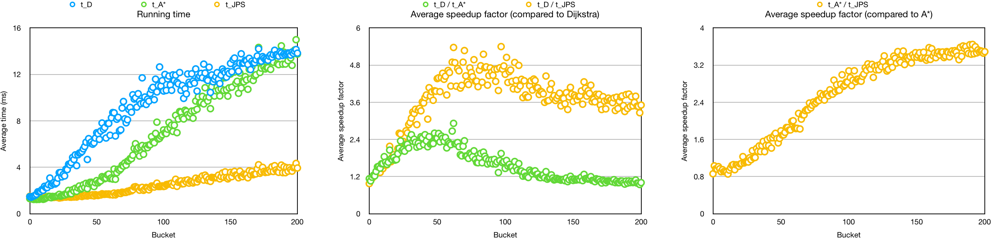

# Implementation document

Pathfinder is a collection of shortest path algorithms for grid-based maps. It can be used in a visualization mode to illustrate the application of individual algorithms, or in a benchmark mode to compare the performance of different algorithms.

## Program structure

Central abstractions for this program include the class Graph and the interface Pathfinder.

Pathfinder is a common interface for shortest path algorithms. It defines the contract between different algorithms and the rest of the program. Pathfinder is implemented by AbstractPathfinder. It provides a skeletal implementation of the Pathfinder interface to minimize the effort required to implement this interface. AbstractPathfinder defines member variables and methods that are shared by all algorithms. Each subclass that extends AbstractPathfinder represents one algorithm for finding a shortest path between two nodes.

The graphs represented in this program are 2-dimensional uniform-cost grids. Hence the class Graph is implemented as a 2-dimensional array of nodes. Nodes are simple coordinate pairs which store a boolean value indicating whether that node is walkable. Edges are not stored but inferred at computation time. In visualization mode, CurrentGraph represents the graph which is currently being edited in this application. It holds a reference to the graph which is of current interest to the user. This is an example of a model suitable for applications which edit only one item at a time.

The diagram below represents a simplified class diagram for the visualization mode. It represents only those classes which are relevant to application logic. In addition, the visualization mode includes many GUI specific classes which are not shown here.

Central concepts in the benchmark mode are scenarios and experiments. Scenarios are sets of experiments and each experiment represents a single benchmark problem. Scenarios (sets of benchmark problems) are stored in CSV files, where each row represents a single experiment.

The main class, Benchmark, uses two classes to handle the workload: ScenarioReader and RunScenario. First, Benchmark uses ScenarioReader to read a set of scenario files. ScenarioReader reads one file at a time and uses ExperimentParser to process each row. Second, Benchmark uses RunScenario to run the set of benchmark problems. RunScenario takes a scenario and runs the experiments it contains. After running the experiments, RunScenario returns a list of results, including the median execution time for each experiment. Finally, Benchmark prints the results.

The diagram below represents a simplified class diagram for the benchmark mode.

## Performance Testing

Algorithms can be compared by running the same set of problems for a number of algorithms. Hence, the basic idea of the benchmark mode is to run a large number of problems for the same set of algorithms. This means running multiple problems on any single map with different source and destination nodes. It also means running the same set of algorithms on a variety of different maps. This means running multiple scenarios and averaging the results.

Each problem represents a small experiment. Each experiment should also be replicated a specified number of times to obtain reliable results. This means running the same shortest path problem for multiple times and taking the median of the running times.

### Results for a single scenario

The figure below presents the results of running a single scenario (dao/lak100d). From the figure it is apparent that, for most problems, A* is faster than Dijkstra and JPS is faster than A*. On the other hand, when path lengths approach the maximum, the performance of Dijkstra and A* is roughly the same.

**A\*:** For most problems, A* is faster than Dijkstra. The average speedup, however, is only 1.6, which is perhaps a bit disappointing. The maximum observed speedup, excluding outliers, is around 2.5. When path lengths approach the maximum, the performance of Dijkstra and A* is roughly the same. This indicates that for sufficiently long paths both Dijkstra and A* expand roughly the same set of nodes. The figure below indicates that this is because each map has limited width and height, which constrains the search. In other words, even though Dijkstra has a tendency to search radially the limits of the map constrain this radial expansion.

**JPS:** For path lengths >50 JPS is faster than both Dijkstra and A*. The average speedup compared to Dijkstra is 3.7, and the average speedup compared to A* is 2.6.

## Aggregated results

Below are the aggregated results for two scenarios

Explanation for the "jumps"

