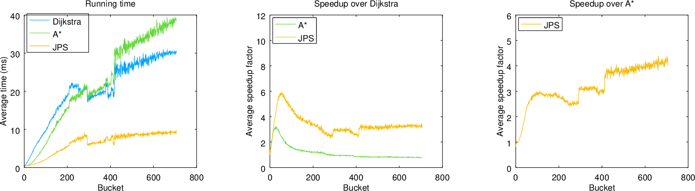
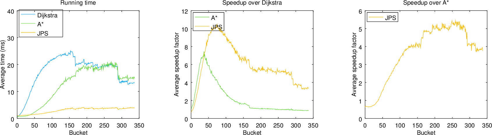
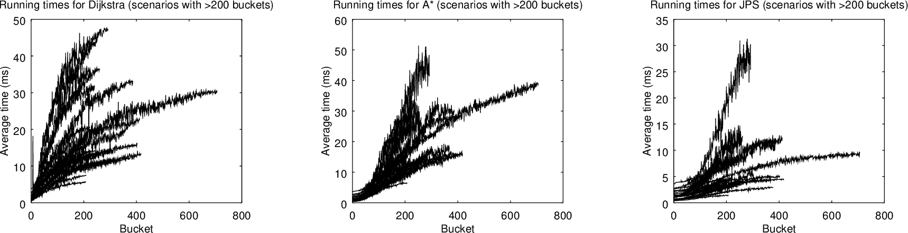

# Implementation document

Table of contents:

* [Javadoc documentation](#javadoc-documentation)
* [Program structure](#program-structure)
* [Imported packages](#imported-packages)
* [Algorithms](#algorithms)
    * [Dijkstra's algorithm](#dijkstras-algorithm)
    * [A*](#a)
    * [Jump point search (JPS)](#jump-point-search-jps)
* [Performance Testing](#performance-testing)
    * [Experimental setup](#experimental-setup)
    * [Results for a single scenario](#results-for-a-single-scenario)
    * [Aggregated results](#aggregated-results)
* [References](#references)

## Javadoc documentation

Javadoc API documentation can be generated with the command

```
./gradlew javadoc
```

This generates a set of HTML documents. They are located under the directory ```build``` and can be opened with the command

```
open build/docs/javadoc/index.html
```

The source code itself is located under the directory [src/main/java/pathfinder/](../src/main/java/pathfinder/).

## Program structure

Central abstractions for this program include the class Graph and the interface Pathfinder.

Pathfinder is a common interface for shortest path algorithms. It defines the contract between different algorithms and the rest of the program. Pathfinder is implemented by AbstractPathfinder. It provides a skeletal implementation of the Pathfinder interface to minimize the effort required to implement this interface. AbstractPathfinder defines member variables and methods that are shared by all algorithms. Each subclass that extends AbstractPathfinder represents one algorithm for finding a shortest path between two nodes.

The graphs represented in this program are 2-dimensional uniform-cost grids. Hence the class Graph is implemented as a 2-dimensional array of nodes. Nodes are simple coordinate pairs which store a boolean value indicating whether that node is walkable. Edges are not stored but inferred at computation time. In visualization mode, CurrentGraph represents the graph which is currently being edited in this application. It holds a reference to the graph which is of current interest to the user. This is an example of a model suitable for applications which edit only one item at a time.

The diagram below represents a simplified class diagram for the visualization mode. It represents only those classes which are relevant to application logic. In addition, the visualization mode includes many GUI specific classes which are not shown here.


Central concepts in the benchmark mode are scenarios and experiments. Scenarios are sets of experiments and each experiment represents a single benchmark problem. Scenarios (sets of benchmark problems) are stored in CSV files, where each row represents a single experiment.

The main class, Benchmark, uses two classes to handle the workload: ScenarioReader and RunScenario. First, Benchmark uses ScenarioReader to read a set of scenario files. ScenarioReader reads one file at a time and uses ExperimentParser to process each row. Second, Benchmark uses RunScenario to run the set of benchmark problems. RunScenario takes a scenario and runs the experiments it contains. After running the experiments, RunScenario returns a list of results, including the median execution time for each experiment. Finally, Benchmark prints the results.

The diagram below represents a simplified class diagram for the benchmark mode.


## Imported packages

This program uses a few imports from the standard Java Class Library (JCL). These are mostly related to I/O such as printing text to a console. The majority of these imports are used to facilitate testing. In our opinion these are not related to the algorithmic core implemented by this program. The algorithms employ only self-implemented data structures.

* **StringBuilder** is used in 3 instances to print some text. StringBuilder is used in RunScenario.printRow, GraphWriter.plotGrid and AbstractCollection.toString. The first uses StringReader to print text to a console. The last two return a string but these methods are only used by unit tests.
* I/O
    * **BufferedReader** is used in the I/O module to read data files. BufferedReader is used by GraphReader and ScenarioReader. To be more specific BufferedReader is used in GraphReader.readFile, GraphReader.read and ScenarioReader.read.
    * **StringReader** is used in unit tests so that there's no need to create auxiliary test files. StringReader is used in GraphReaderTest and JumpTest. In both cases a map specification is given as a string and then passed to GraphReader. The alternative would be create a separate test file for each unit test.
    * **PrintStream** is used to facilitate testing. Instead of printing to ```System.out``` the program prints text to a ```PrintStream``` passed as a constructor's parameter. This means that unit tests can check if the program would print the correct text to the user's console. PrintStream is used to print text by the classes Benchmark and RunScenario. The corresponding unit tests BenchmarkTest and RunScenarioTest check the contents of PrintStream against what would be expected.

## Algorithms

In this section we shall present pseudocode for the different algorithms, and consider their complexity. The pseudocode for Dijkstra and A* has been adapted from the lecture notes [1]. The pseudocode for JPS has been adapted from the corresponding papers [2] and [3]. The following descriptions are rather brief. Further information can be found from the references, and a number of other sources.

### Dijkstra's algorithm

Dijkstra's algorithm is a general algorithm for finding shortest paths between nodes in a graph.

Before describing the actual algorithm, we shall need the following operations: initialization and an update operation called relaxation.

```
Initialize-Dijkstra(G,s)
    for all nodes v in V
        distance[v] = infinity
        path[v] = NIL
    distance[s] = 0

Relax-Dijkstra(u,v,w)
    if distance[v] > distance[u] + w(u,v)
        distance[v] = distance[u] + w(u,v)
        path[v] = u
```

Dijkstra's algorithm maintains a set which consists of those nodes whose shortest distance is already known. This is known as the closed set. On each iteration Dijkstra's algorithm considers the remaining nodes (whose distance is still unknown), and picks the node with the smallest distance estimate. This is a greedy strategy. The following pseudocode uses a heap to store those nodes which have been discovered, but whose distance is still unknown.

```
Dijkstra(G,w,s)
    Initialize-Dijkstra(G,s)
    for all nodes v in V
        heap-insert(H,v,distance[v])
    while not empty(H)
        u = heap-del-min(H)
        for each node v in neighbours[u]
            Relax-Dijkstra(u,v,w)
            heap-decrease-key(H,v,distance[v])
```

When using a binary heap, the time complexity of Dijkstra's algorithm is O((V + E)log(V)). The space complexity is O(V).

### A*

A* is another general algorithm for finding shortest paths between nodes in a graph. However, unlike Dijkstra's algorithm, A* uses a heuristic function to guide the search towards directions which seem promising.

We shall use the octile distance as the heuristic function. Here a and b are any two nodes.

```
heuristic(a,b)
    dx = abs(b.x - a.x)
    dy = abs(b.y - a.y)
    return (dx + dy) + (sqrt(2) - 2) * min(dx, dy)
```

Again, before describing the actual algorithm, we shall need the following operations: initialization and an update operation called relaxation. Here a and b are the source and destination nodes, respectively.

```
Initialize-Astar(G,a,b)
    for all nodes v in V
        g[v] = infinity
        h[v] = heuristic(v,b)
        path[v] = NIL
    g[a] = 0

Relax-Astar(u,v,w)
    if g[v] > g[u] + w(u,v)
        g[v] = g[u] + w(u,v)
        path[v] = u
```

The operation of A* is very similar to Dijkstra's algorithm. The primary difference is the use of a heuristic function.

A* maintains two values for each node: the estimated distance from the source node (g), and the estimated distance to the destination node (h). When choosing the next node, we consider the sum g[v]+h[v]. These are the priorities we shall use when constructing and maintaining the heap.

```
Astar(G,w,a,b)
    Initialize-Astar(G,a,b)
    for all nodes v in V
        heap-insert(H,v,g[v]+h[v])
    while not empty(H)
        u = heap-del-min(H)
        for each node v in neighbours[u]
            Relax-Astar(u,v,w)
            heap-decrease-key(H,v,g[v]+h[v])
```

When using a binary heap, the time complexity of A* is O((V + E)log(V)). The space complexity is O(V).

### Jump point search (JPS)

Jump point search is a specialized algorithm for uniform-cost grids. It's a modified version of A* which takes advantage of path symmetry, prevalent in the grid domain.

The basic idea is to prune all potential successors which can be reached by another path which is shorter than, or symmetric to, the current path. To accomplish this JPS employs two sets of rules: pruning rules and jumping rules. The rules are presented in [2] and [3]. We shall not present them here. We will only note that pruning is an operation which takes constant time and space. Jumping is described at the level of pseudocode, below.

Jump point search operates in a couple of stages:

1. List the neighbours of the current node. We shall refer to this list as ```neighbours(x)```.
2. Prune the set of neighbours. We shall call the pruned set of neighbours as the natural successors of the node x. We will refer to this set as ```pruned_neighbours```.
3. For each node n in ```pruned_neighbours``` find the so called jump point successor of that node. We shall call the resulting set of nodes as the jump point successors of the node x. We shall refer to this set as ```successors```.

In practice, when implementing JPS the stages 1 and 2 are combined but here we shall consider them as separate.

JPS can be described as two methods: ```identify_successors``` and ```jump```. We shall list them here. In the following pseudocode ```direction(x,n)``` denotes a vector which points from x to n.

```
identify_successors(x,a,b)
    successors = empty set
    pruned_neighbours = prune(x,neighbours(x))
    for all n in pruned_neighbours
        n = jump(x,direction(x,n),a,b)
        add n to successors
```

In the following pseudocode d denotes one of the eight allowable movement directions. If d is a diagonal move, then d_1 and d_2 denote the two straight moves at 45 degree angle to d.

```
jump(x,d,a,b)
    n = step(x,d)
    if n is an obstacle or is outside the grid
        return NIL
    if n = b
        return n
    if exists n' in neighbours(n) such that n' is forced
        return n
    if d is diagonal
        for all i in {1,2}
            if jump(n,d_i,a,b) is not NIL
                return n
    return jump(n,d,a,b)
```

When using a binary heap, the time complexity of JPS is O((V + E)log(V)). The space complexity is O(V). Hence, all pathfinding algorithms presented here have the same asymptotic time and space complexity. However, in practice there can a significant difference in performance.

## Performance Testing

Algorithms can be compared by running the same set of problems for a number of algorithms. This means running multiple problems on any single map with different source and destination nodes. It also means running the same set of algorithms on a variety of different maps.

### Experimental setup

We run an experiment designed to compare the performance of three algorithms: Dijkstra, A* and Jump point search (JPS). We use our own implementations written in Java. The code for these implementations is available in this GitHub repository.

We use standard benchmark problem sets [4] available from the site [movingai.com/benchmarks/](https://www.movingai.com/benchmarks/). We use the following problem sets extracted from commercial video games:

* **Dragon Age: Origins (DAO).** 156 maps with a total of 155&nbsp;620 instances.
* **Dragon Age 2 (DA2).** 67 maps with a total of 67&nbsp;200 instances.
* **Baldurs Gate II, scaled to 512x512 (BG512).** 75 maps with a total of 122&nbsp;600 instances.

As intended in the problem sets, we disallow corner-cutting diagonal movement.

We measure performance in terms of running time. To measure running time we compute each problem instance 10 times, and store the median running time for each algorithm. We use the median instead of the mean because, in Java, garbage collection (GC) and just-in-time (JIT) compilation may introduce outliers, which we'd like to exclude from the analysis.

We run the experiments on a 2013 MacBook Pro running macOS High Sierra. Our test machine has a 2.4 GHz Intel Core i5 processor and 8 GB of RAM. We use Java SE Runtime Environment 8.

### Results for a single scenario

The problem sets categorize problems into larger buckets. Given the optimal solution length, the bucket for a path of length L is floor(L/4). Reporting results in buckets reduces the variance and makes it easier to compare similar problems across maps. Each bucket on each map contains at most 10 problems. [4]

We would like to describe running time as a function of path length. To describe running time across similar problem instances we use the median running time averaged across buckets. We average (within each bucket) across problem instances in the same scenario. This gives us the average running time for each bucket. In other words, we get the average running time as a function of path length.

Running time is described first in absolute terms (milliseconds), and then mostly in relative terms (speedup). The speedup factor is the ratio of two running times. It is the relative improvement to the time taken to solve a given problem. A speedup factor of 2.0 implies that the running time is twice as fast, that is the problem can be solved in half the time.

The figure below presents the results of running a single scenario. The scenario in question is "lak100d" from the DAO problem set.


**A\*:** For most problems, A* is faster than Dijkstra. The average speedup, however, is only 1.6, which is perhaps a bit disappointing. The maximum observed speedup, excluding outliers, is around 2.5. When path lengths approach the maximum, the performance of Dijkstra and A* is roughly the same. This indicates that for sufficiently long paths both Dijkstra and A* expand roughly the same set of nodes. The figure below indicates that this is because each map has limited width and height, which constrains the search. In other words, even though Dijkstra has a tendency to search radially the limits of the map constrain this radial expansion.

**JPS:** For path lengths >50 JPS is faster than both Dijkstra and A*. The average speedup compared to Dijkstra is 3.7, and the average speedup compared to A* is 2.6.


### Aggregated results

Again, we would like to describe running time as a function of path length. In this case we average (within each bucket) across all problem instances in the same problem set. This gives us the average running time for each bucket. In other words, we get the average running time as a function of path length.

Below are the aggregated results for three problem sets: DAO, DA2 and BG512.





Running times are in the range of 0-40 ms. The DAO problem set has the longest paths and therefore the longest running times. In general running times increase as a function of path length. In other words, longer paths tend to take a longer time to compute. The BG512 set, however, is a peculiar exception to this rule. Many of the curves also have "jumps". These are studied more closely below.

A* obtains a 1-2 times speedup compared to Dijkstra (for path lengths >100). For short paths the speedup is the greatest for the BG512 problem set, where A* is up to 7 times faster than Dijkstra. On the other hand, when path lengths approach the maximum, the performance of Dijkstra and A* is roughly the same.

JPS obtains a 3-5 times speedup compared to A*, and a 3-10 times speedup compared to Dijkstra. The speedup compared to Dijkstra is most pronounced for relatively short paths, and in particular for the BG512 problem set. This is probably due the different nature of the problem sets. The titles in the Dragon Age series are role-playing games (RPG), where the maps are more linear; Baldur's Gate on the other hand is a real-time strategy game (RTS), where the maps are more two-dimensional.

Explanation for the "jumps": Some individual scenarios are much faster/slower than the average. The difference in running times is large enough to skew the average downwards/upwards. When such a scenario ends (the scenarios have different lengths), the average shifts abruptly in the opposite direction. This process is depicted in the picture below, which shows the running times for individual scenarios in the DAO problem set.



## References
1. Kivinen, J. (2018), "Data structures and algorithms, Spring 2018", Lecture notes for the course Data structures and algorithms at the University of Helsinki.
2. Harabor, D. and Grastien, A. (2011), "Online Graph Pruning for Pathfinding on Grid Maps", 25th National Conference on Artificial Intelligence, AAAI.
3. Harabor, D. and Grastien, A. (2012), "The JPS Pathfinding System", 26th National Conference on Artificial Intelligence, AAAI.
4. Sturtevant, N. (2012), "Benchmarks for Grid-Based Pathfinding", IEEE Transactions on Computational Intelligence and AI in Games, 4(2): 144-148.
