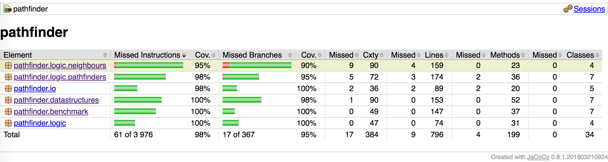

# Testing document

## Unit Testing

Approximately 190 unit tests, written with the JUnit unit testing framework. Line coverage of 98 % and branch coverage of 95 %.



Unit tests can be run from the command-line with the command

```
gradle test jacocoTestReport
```

This command creates two reports: a test report and a JaCoCo code coverage report. They are located under the directory ```build``` and can be opened as follows:

```
open build/reports/tests/test/index.html
open build/reports/jacoco/test/html/index.html
```

The rest of this section describes package-by-package what kind of unit testing is done. All packages except the GUI have unit tests. The GUI packages do not have unit tests.

### Package pathfinder.benchmark

This package is the main package for the benchmark mode. Central test classes include RunExperimentTest, RunScenarioTest and BenchmarkTest. These test progressively larger and larger units of code.

Each experiment produces two values: the length of a shortest path (optimal distance), and the time taken to solve the problem (time). Both are tested. Optimal distance is compared against known values, either computed by hand (for small problems), or reference values taken from the problem sets (for large problems). This gives a measure on the correctness of the computed solution. The computed optimal distance should be, within rounding error, equal to the expected value. Time is tested either with the help of a StubTimer (a timer which always returns a duration of 1 ms), or using regular expressions. Times are tested to verify that the timing functionality is working as expected. Naturally, this also is important for reliable benchmarking.

The following test case illustrates how the testing is done. This code is from RunScenarioTest.

```java
    @Before
    public void setUp() {
        outContent = new ByteArrayOutputStream();
        out = new PrintStream(outContent);
        timer = new StubTimer();
    }

    @Test
    public void exampleScenarioPrintsExpectedResults() throws Exception {
        List<Experiment> experiments = new ScenarioReader().read(SCENARIO_FILE);
        RunScenario runner = new RunScenario(REPLICATES, MAP_DIRECTORY, timer, CC, out);

        runner.run(experiments);

        // Column headers: bucket, time_Dijkstra, time_A*, time_JPS, dist_Dijkstra, dist_A*, dist_JPS
        // Times are 1 because we use the stub timer which always returns 1
        // Distances should match the reference values (and be the same for all algorithms)
        assertEquals(""
                + "0	1.000	1.000	1.000	2.82842712	2.82842712	2.82842712\n"
                + "0	1.000	1.000	1.000	2.41421356	2.41421356	2.41421356\n"
                + "0	1.000	1.000	1.000	3.82842712	3.82842712	3.82842712\n"
                // ...
                + "1	1.000	1.000	1.000	6.41421356	6.41421356	6.41421356\n"
                + "1	1.000	1.000	1.000	7.24264069	7.24264069	7.24264069\n"
                + "1	1.000	1.000	1.000	6.65685425	6.65685425	6.65685425\n",
                outContent.toString());
    }
```

The output of the benchmark mode is written to a PrintStream which, in this case, is connected to an underlying ByteArrayOutputStream. This implies that we can test the output of the program with a big assert statement.

The output is a big table which specifies the execution time and optimal distance for each problem and algorithm. Each row corresponds to a single experiment. The execution times are all 1.000 because we are using StubTimer. The optimal distance is the same for all three algorithms, and should match the optimal distance specified in the problem set.

### Package pathfinder.datastructures
### Package pathfinder.io
### Package pathfinder.logic
### Package pathfinder.logic.neighbours
### Package pathfinder.logic.pathfinders

## Manual testing
