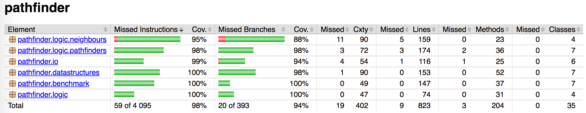

# Testing document

## Unit Testing

Unit tests can be run from the command-line with the command

```
gradle test jacocoTestReport
```

This command creates two reports: a test report and a JaCoCo code coverage report. They are located under the directory ```build``` and can be opened as follows:

```
open build/reports/tests/test/index.html
open build/reports/jacoco/test/html/index.html
```

There are approximately 190 unit tests, written with the JUnit unit testing framework. These give a combined line coverage of 98 % and a  branch coverage of 95 %. Furthermore, as can be seen from the table below, each individual package has a test coverage of over 90 %.



The rest of this section describes package-by-package what kind of unit testing is done. All packages except the GUI have unit tests. The GUI packages do not have unit tests.

### Package pathfinder.benchmark

This package is the main package for the benchmark mode. Central test classes include RunExperimentTest, RunScenarioTest and BenchmarkTest. These test progressively larger and larger units of code.

Each experiment produces two values: the length of a shortest path (optimal distance), and the time taken to solve the problem (time). Both are tested. Optimal distance is compared against known values, either computed by hand (for small problems), or reference values taken from the problem sets (for large problems). This gives a measure of the correctness of the computed solution. The computed optimal distance should be, within rounding error, equal to the expected value. Time is tested either with the help of a StubTimer (a timer which always returns a duration of 1 ms), or using regular expressions. Times are tested to verify that the timing functionality is working as expected.

The following test case illustrates how the testing is done. This code is from [RunScenarioTest](https://github.com/mriekkin/pathfinder/blob/master/src/test/java/pathfinder/benchmark/RunScenarioTest.java).

```java
ByteArrayOutputStream outContent;
PrintStream out;
Timer timer;

@Before
public void setUp() {
    outContent = new ByteArrayOutputStream();
    out = new PrintStream(outContent);
    timer = new StubTimer();
}

@Test
public void exampleScenarioPrintsExpectedResults() throws Exception {
    List<Experiment> experiments = new ScenarioReader().read(SCENARIO_FILE);
    RunScenario runner = new RunScenario(REPLICATES, MAP_DIRECTORY, timer, CC, out);

    runner.run(experiments);

    // Column headers: bucket, time_Dijkstra, time_A*, time_JPS, dist_Dijkstra, dist_A*, dist_JPS
    // Times are 1 because we use the stub timer which always returns 1
    // Distances should match the reference values (and be the same for all algorithms)
    assertEquals(""
            + "0	1.000	1.000	1.000	2.82842712	2.82842712	2.82842712\n"
            + "0	1.000	1.000	1.000	2.41421356	2.41421356	2.41421356\n"
            + "0	1.000	1.000	1.000	3.82842712	3.82842712	3.82842712\n"
            // ...
            + "1	1.000	1.000	1.000	6.41421356	6.41421356	6.41421356\n"
            + "1	1.000	1.000	1.000	7.24264069	7.24264069	7.24264069\n"
            + "1	1.000	1.000	1.000	6.65685425	6.65685425	6.65685425\n",
            outContent.toString());
}
```

The output of the benchmark mode is written to a PrintStream which, in this case, is connected to an underlying ByteArrayOutputStream. This implies that we can test the output of the program with a big assert statement.

The output is a big table which specifies the execution time and optimal distance for each problem and algorithm. Each row corresponds to a single problem. The execution times are all 1.000 because we are using StubTimer. The optimal distance should be the same for all three algorithms, and should match the optimal distance specified in the problem set.

The scenario used here is [grids/tests/example.map.scen](https://github.com/mriekkin/pathfinder/blob/master/grids/tests/example.map.scen). This scenario was built by taking a piece of the (much larger) scenario [grids/dao/lak100d.map.scen](https://github.com/mriekkin/pathfinder/blob/master/grids/dao/lak100d.map.scen). Since this example scenario includes only the first two buckets the optimal paths are relatively short.

### Package pathfinder.datastructures

This package contains all self-implemented data structures. The test classes are ArrayListTest, ArrayStackTest and MinHeapTest.

These unit tests are relatively straightforward. First, an instance of the data structure is created, and filled with a small amount of test data. Second, a number of tests is run on the pre-filled data structure. We've chosen here one example from [MinHeapTest](https://github.com/mriekkin/pathfinder/blob/master/src/test/java/pathfinder/datastructures/MinHeapTest.java):

```java
MinHeap<Integer> heap;

@Before
public void setUp() {
    heap = new MinHeap<>();
    heap.add(10);
    heap.add(11);
    heap.add(12);
    heap.add(13);
    heap.add(14);
    heap.add(15);
}

@Test
public void pollReturnsMinimalElement() {
    assertEquals(Integer.valueOf(10), heap.poll());
}

@Test
public void pollRemovesMinimalElement() {
    heap.poll();
    assertEquals(5, heap.size());
    assertEquals("[11, 13, 12, 15, 14]", heap.toString());
}

@Test
public void canPollRepeatedly() {
    heap.poll();
    heap.poll();
    assertEquals(4, heap.size());
    assertEquals("[12, 13, 14, 15]", heap.toString());
}

@Test
public void canPollUntilEmpty() {
    heap.poll();
    heap.poll();
    heap.poll();
    heap.poll();
    heap.poll();
    heap.poll();
    assertEquals(0, heap.size());
}

@Test
public void pollReturnsNullIfQueueIsEmpty() {
    heap = new MinHeap<>();
    assertNull(heap.poll());
}
```

The interesting point here is the use of ```heap.toString()``` which produces a string representation of the underlying array. This allows us to compare the contents of the heap with a solution computed by hand.

### Package pathfinder.io


**TODO: FINISH THE I/O MODULE AND THEN UPDATE THIS SECTION!**


### Package pathfinder.logic

This package contains classes related to application logic. It contains frequently used classes such as Graph and Node. Most of these unit tests, however, are also relatively straightforward.

We've chosen here one example from [GraphSetupTest](https://github.com/mriekkin/pathfinder/blob/master/src/test/java/pathfinder/logic/GraphSetupTest.java). This example sets up a grid and then compares the result to what we would expect. The comparison is based on the grid's textual representation which is obtained by calling ```GraphWriter.plotGrid```.

```java
@Test
public void setUpBigGrid() {
    Pair dimensions = new Pair(30, 15);
    Pair source = new Pair(8, 7);
    Pair dest = new Pair(17, 2);
    Graph g = new Graph(dimensions, source, dest);

    for (int y = 3; y <= 11; y++) {
        g.getNode(3, y).setWalkable(false);
        g.getNode(4, y).setWalkable(false);
    }

    for (int y = 4; y <= 14; y++) {
        g.getNode(13, y).setWalkable(false);
        g.getNode(14, y).setWalkable(false);
    }

    // ...

    assertEquals(""
            + ".....................##.......\n"
            + ".....................##.......\n"
            + ".................B...##.......\n"
            + "...##................##.......\n"
            + "...##........##......##.......\n"
            + "...##........##......#####....\n"
            + "...##........##......#####....\n"
            + "...##...A....##...............\n"
            + "...##........##...............\n"
            + "...##........##...............\n"
            + "...##........##...............\n"
            + "...##........##...............\n"
            + ".............##...............\n"
            + ".............##...............\n"
            + ".............##...............",
            GraphWriter.plotGrid(g));
}
```

One side note: even though the method is named setUpBigGrid, this grid is very small compared to some of the larger grids in the problem sets.

### Package pathfinder.logic.neighbours

This package contains classes for looking up the neighbours of a specified node.

The produce a list of neighbours the program has to check each adjacent node, and then return a list of those which are walkable. This is the usual approach which is implemented by the class Neighbours. Jump point search, however, goes further by applying a prune operation on the usual list of neighbours. This pruning operation is implemented by the classes NeighbourPruningRulesCcAllowed and NeighbourPruningRulesCcDisallowed. These implement two flawors of pruning: with and without corner-cutting. These pruning operations are described in more detail in [1] and [2].

We've chosen here an example from [NeighbourPruningRulesCcDisallowedTest](https://github.com/mriekkin/pathfinder/blob/master/src/test/java/pathfinder/logic/neighbours/NeighbourPruningRulesCcDisallowedTest.java). This example corresponds to cases (a) and (b) in the figure below. In (a) we have a straight move from p to x where only one natural neighbour remains. In (c) obstacles around x cause some neighbours to become forced. This figure is from a paper by Harabor and Grastien [2].


In the code segment below x is located at the node (5,&nbsp;5). This means that p is at (4,&nbsp;5) and the obstacle in (c) is at (4,&nbsp;4). Another obstacle is placed below x at (4,&nbsp;6).

```java
Graph g;

@Before
public void setUp() {
    Pair dimensions = new Pair(10, 10);
    Pair source = new Pair(1, 1);
    Pair dest = new Pair(9, 9);
    g = new Graph(dimensions, source, dest);
}

@Test
public void returnsNaturalNeighboursForHorizontalMove() {
    NeighbourPruningRules prune = new NeighbourPruningRulesCcDisallowed(g);
    Node p = g.getNode(4, 5);
    Node x = g.getNode(5, 5);
    List<Node> neighbours = prune.getPrunedNeighbours(p, x);
    assertEquals(1, neighbours.size());
    assertEquals("(6, 5)", neighbours.get(0).toString());
}

@Test
public void returnsForcedNeighboursForHorizontalMove() {
    NeighbourPruningRules prune = new NeighbourPruningRulesCcDisallowed(g);
    Node p = g.getNode(4, 5);
    Node x = g.getNode(5, 5);
    g.getNode(4, 4).setWalkable(false); // Add obstacles,
    g.getNode(4, 6).setWalkable(false); // which should create forced neighbours
    List<Node> neighbours = prune.getPrunedNeighbours(p, x);
    assertEquals(5, neighbours.size());
    assertEquals("(6, 5)", neighbours.get(0).toString()); // 1 natural neighbour
    assertEquals("(5, 4)", neighbours.get(1).toString()); // 4 forced neighbours
    assertEquals("(6, 4)", neighbours.get(2).toString());
    assertEquals("(5, 6)", neighbours.get(3).toString());
    assertEquals("(6, 6)", neighbours.get(4).toString());
}
```

### Package pathfinder.logic.pathfinders

## Manual testing


## References

[1] Harabor, D. and Grastien, A. (2011), "Online Graph Pruning for Pathfinding on Grid Maps", 25th National Conference on Artificial Intelligence, AAAI.
[2] Harabor, D. and Grastien, A. (2012), "The JPS Pathfinding System", 26th National Conference on Artificial Intelligence, AAAI.
