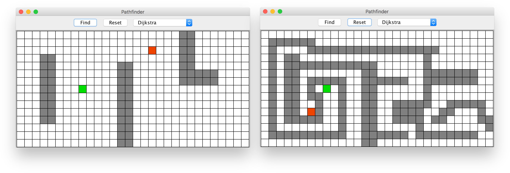

# User guide

Table of contents:

* [Obtaining a copy of the repository](#obtaining-a-copy-of-the-repository)
* [Visualization mode](#visualization-mode)
    * [Running the visualization mode](#running-the-visualization-mode)
    * [Basic usage of the visualization mode](#basic-usage-of-the-visualization-mode)
    * [Working with large maps](#working-with-large-maps)
* [Benchmark mode](#benchmark-mode)
    * [Running the problem sets](#running-the-problem-sets)
    * [Analyzing the results](#analyzing-the-results)
    * [Running individual scenarios](#running-individual-scenarios)

## Obtaining a copy of the repository

You can clone the repository with the following command, which should be entered on the command-line.

```bash
git clone https://github.com/mriekkin/pathfinder.git
```

This might take a while because the repository is rather large, around 180 MB. Most of this size is due to a large number of data files. In case you don't have git installed, you may also download the repository as a ZIP file. Just download and extract the ZIP archive to a convenient location. Then change the current directory to the project's root directory.

```bash
cd pathfinder
```

All subsequent commands should be entered in the project's root directory.

## Visualization mode

### Running the visualization mode

The visualization mode can be run by executing the command

```bash
./gradlew run
```

Alternatively, you may create a JAR file and execute it with the commands

```bash
./gradlew jar
java -jar build/libs/pathfinder.jar
```

On a Windows machine you should use slightly different commands ```gradlew.bat run``` and ```gradlew.bat jar```.

The first time you issue any of these commands, a copy of the Gradle distribution is downloaded and stored in the local filesystem. This means that you don't have to install the Gradle runtime manually. All of this is done by the Gradle Wrapper (```gradlew``` or ```gradlew.bat```).

### Basic usage of the visualization mode

When the program opens it displays a pre-loaded map. This map, shown below on the left, opens every time the program is opened.

Each map represents one particular graph. In this application each graph is a 2-dimensional grid. The grid consists of nodes each of which is either walkable or unwalkable (blocked). Walkable nodes represent open areas, and unwalkable nodes represent obstacles. Walkable nodes are marked in white and unwalkable nodes in gray. Under the hood each walkable nodes is connected to those of its neighbours which are also walkable. All edges have the same weight, so the weights are assumed to be 1. Each map has also one source node and one destination node. The source node is marked in green and the destination node in orange red.

Obstacles can be placed and removed with the mouse. Clicking on a node toggles that node as either walkable or unwalkable (blocked). You can also drag the mouse to place or remove multiple obstacles at once. Dragging on the source or destination node, however, moves it to another location. One constructed map is shown below, on the right.



To select an algorithm use the combo box on the top-right. Three algorithms are available: Dijkstra, A* and Jump point search (JPS). Dijkstra and A* are general algorithms but Jump point search is a specialized algorithm for uniform-cost grids.

To find a shortest path press the button Find. This instructs the program to find a shortest path using the currently selected algorithm. The computations should finish rather quickly, in a matter of milliseconds. Once the computations are complete the program displays the final stage of running the algorithm (visualization of the intermediate steps is not yet supported).

When viewing the results you can see that some of the nodes are marked in blue. These are the nodes which have been expanded by the selected algorithm. A coarse visual comparison of the three algorithms reveals a distinctive difference in the number of nodes expanded. This can be seen in the figure below. In addition, a shortest path is painted with a yellow line. Because of path symmetry, there often are multiple shortest paths. Hence the different algorithms may return a slightly different shortest path.


To create a new map select the menu File >> New. This creates an empty grid, and places the source and destination nodes at the corners. You can also open a previously created map. To open a map select the menu File >> Open. A few example maps are available in the subdirectory ```grids```. This is discussed further in the next section. At the moment, you cannot save the maps you create because *saving is not yet supported*. Hence, new map files can be created only with the help of a text editor. If you wish to try this, you'll find that the map format is pretty self-explanatory.

The application has a few preference options to choose from. To edit user preferences select the menu Preferences >> Preferences. The first option is the cell size. This is the size of each node on screen, in pixels. In other words, this a "zoom in" and "zoom out" option. The second option is whether corner-cutting is allowed. If corner-cutting is allowed, the paths can cross corners. This makes for smoother looking paths but is somewhat unrealistic. By default corner-cutting is disallowed.

### Working with large maps

We shall show how to work with a large map copied from one of the problem sets.

When working with large maps the keyword is zooming. First, you should select the menu Preferences >> Preferences and adjust the cell size option. For viewing large maps *the best cell size is 1*. This paints each node with just one pixel and omits the cell borders.

You can open a map by selecting the menu File >> Open. In this example we open the file ```grids/maze512-8-0.map```. This is a 512x512 maze where the width of each corridor is 8. The maze and its solution with A* is shown below.


The picture below shows the solution of the same maze but this time with each of the three algorithms.


Finally, a few words of warning regarding large maps.

The editing of large maps is rather difficult. Editing at this zoom level is not really meaningful because each node is only one pixel in size. To make any meaningful edits you would have to zoom in quite a bit. However, because these maps are so large, editing them one section at a time would be rather laborious. Therefore, while large maps are suitable for viewing and benchmarking, they are not really meant to be edited in this way.

You may interested to try out the maps in the subdirectories ```grids/dao```, ```grids/da2``` etc. These are original, unmodified benchmark maps downloaded from the site [movingai.com/benchmarks](https://www.movingai.com/benchmarks/). However, there's one problem with these maps: they don't contain the position of the source and destination nodes. Hence, by default this program places the source and destination nodes at the coordinates (0, 0) (the top-left corner). If you wish to try out these benchmark maps, you have to drag the source and destination nodes to another location. However, you may find this rather difficult or at least laborious. Hence, it's easier to just stick with the few examples maps provided in the directory ```grids```.

## Benchmark mode

### Running the problem sets

The benchmark mode only supports UNIX-like systems. The benchmark mode employs a shell script which invokes the Java runtime. Since shell scripts only work on UNIX-like systems, the benchmark mode cannot be run on Windows machines. Windows users can still run individual scenarios, as explained below, but they cannot use the benchmark script, which would run the full range of benchmarks.

The benchmark mode can be run with the command

```bash
./benchmark
```

This runs a shell script, which is in the project's root directory. By default, this runs the full range of problem sets. To add or remove problem sets you can modify the script's last few lines, which are

```bash
run_problem_set "da2"
run_problem_set "dao"
run_problem_set "bg512"
run_problem_set "sc1"
```

Running the problem sets is a time consuming process. You should expect each problem set to take several hours to complete. On our test machine the computations for each problem set would take from 2 hours (DA2) to up to 8 hours (DAO and BG512) and up to a day (SC1). The benchmarks are run on a single thread so on a multicore machine the CPU utilization remains below 100&nbsp;%. Regardless, to get reliable results one should not work on other tasks while running the benchmarks. Hence, it's convenient to run the benchmarks overnight.

### Analyzing the results

Benchmark mode creates a set of files under the subdirectory ```results/data```. These files are organized according to a timestamp and the originating problem set. The data are a set of CSV files where each file corresponds to a single scenario. For instance, the DAO problem set has 156 maps (and the same number of scenarios), so the results are a set of 156 CSV files. The [results file format](Results_file_format.md) is described in another document.

We have provided Matlab/Octave scripts for analyzing the results. One may use either Matlab or Octave, but here we use Octave, which is [freely available](https://www.gnu.org/software/octave/). To run the scripts, start Octave and navigate to the subdirectory ```results```. Then you can issue, in Octave, the following command

```octave
results2
```

which runs the analysis. To change the settings you can modify the top portion of the file ```results2.m```, which looks like this

```octave
TIMESTAMP = "180831";
PROBLEM_SET = "dao";
```

This analyzes the data in the subdirectory ```results/data/180831/dao```. To analyze multiple problem sets you have to run the script multiple times with the appropriate settings.

### Running individual scenarios

If you can run the benchmark mode, then running individual scenarios should not be necessary. However, we describe the process here for completeness.

Individual scenarios can be run with the command

```
java -jar build/libs/pathfinder.jar -b grids/dao/lak100d.map.scen
```

Here ```-b``` refers to the benchmark mode. Without it the application will start in the visualization mode. The last parameter specifies the scenario file to be used. This command will print out a large table of [data](Results_file_format.md). To save the results the output can be piped to a file. In fact, this is the approach used by the benchmark script.
