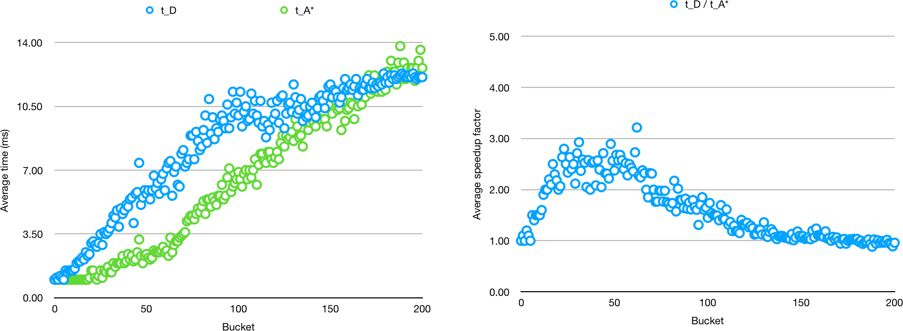

# Week 2

[Hour reporting](Hour_reporting.md)

## What happened during week 2

In this week I designed and implemented the benchmark mode.

I started by reading the [paper](http://web.cs.du.edu/~sturtevant/papers/benchmarks.pdf) by Sturtevant.

The basic idea is to use the benchmarks provided by Sturtevant. Using these benchmarks I would like to do an analysis which is somewhat similar to the one done by Harabor and Grastien. That is, I'll run a set of scenarios and, for each algorithm, compute the average search time as a function of path length. This should allow a comparison of the different algorithms. However, I might have do some additional testing to confirm the asymptotic running times as a function of |V| and |E|.

To implement this idea I need a system which can run the scenario files provided by Sturtevant. This is the job of the benchmark mode.

I implemented the benchmark mode by writing a series of incremental versions. I was able to write the first draft in a day, but finishing it took a few more days. This included refactoring, testing and documenting the benchmark mode. Most of the work is in the package pathfinder.benchmark. There are also a few classes in the package pathfinder.io. The test coverage is currently 96 %.

The benchmark mode is a command-line application. It can be run as follows.

```
gradle jar
java -jar build/libs/pathfinder.jar -b grids/lak100d.map.scen
```

This runs the scenario defined in the file `grids/lak100d.map.scen` and prints the results. The switch `-b` refers to the benchmark mode. Without it the program will start in the visualization mode. The following not only prints the results but also saves the results to a CSV file.

```
mkdir grids/results
java -jar build/libs/pathfinder.jar -b grids/lak100d.map.scen | tee grids/results/lak100d_results.csv
```

Below is a picture of the results. Here I've taken an average over *buckets*. This means taking an average of 10 experiments which have very similar path lengths. The definition of a bucket is floor(length/4).



I had planned to continue this week with a more thorough testing of the Jump point search (JPS) implementation. As it turns out, I didn't have time for this so I'll continue with that next week. However, I did discover a problem with my implementation. More on that below.

## Problems

I discovered a problem with my implementation of Jump point search which is still *unfixed*. The problem appears only in some cases, while most seem to work just fine. In a problematic case the actual algorithm completes normally but construction of the shortest path (by following predecessor relationships) results in an infinite loop. Because of this problem, at this moment, I cannot run scenarios using JPS.

I haven't yet had the time to study this problem properly, but in one case I studied it seemed like the computed path had a loop. To me that seems rather odd.

## Questions

Do my plans for benchmarking the algorithms seem reasonable?

## Next week

Next week will probably include a number of tasks. I'll start by testing the JPS implementation, and I'll try to fix the problem described above. Then I'll be able to run more scenarios and can start to write the implementation and testing documentation. Finally, if time permits, I'll start work on data structures.
