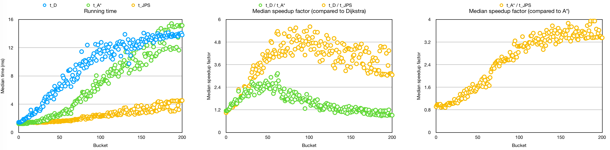

# Week 4

[Hour reporting](Hour_reporting.md)

## What happened during week 4

In this week I worked on a number of distinct tasks:

1. I tested my JPS implementation, and fixed the previously discovered problem (infinite loop with some problem instances). The problem was in JumpPointSearch.run which I had modified so that it was different from a standard A*. I don't recall why I did it, but the problem was fixed by reverting that change. Now my JPS seems to be working.
2. I wrote a version of JPS without corner cutting ("[JPS 2012](https://www.aaai.org/ocs/index.php/SOCS/SOCS12/paper/download/5396/5212)"), and refactored the application so that the user may choose if corner-cutting is enabled. There's even now a GUI option for that. This change was necessary because the benchmark problems assume that corner-cutting is not allowed. However, looking back, it might have been better to just stick with the one-option approach (no corner-cutting). Adding the option to choose took quite a bit of time.
3. I began to write the implementation document. I started by drawing a bunch of class diagrams, and wrote a section describing the class structure. I think the class structure is sufficient as it is. However, I think the interface Pathfinder could be called ShortestPath, or something similar.
4. I wrote a section on performance testing. At this point I just described a single scenario, but I expect the results will be similar when I'll run more scenarios. The implementation document as a whole has around 3 pages of content (with pictures), so it's a good starting point, but it hasn't been polished.
5. I merged to master my previous work on a resizable array (ArrayList). It's pretty much complete. I'll just need to implement the interface Iterable<T> so that this implementation can be the target of a "for-each loop" statement.

I think the core functionality can be considered pretty much complete. Both Benchmark and the GUI have some tasks pending but the algorithmic core seems solid.

## Problems

My main problem this week was that some tasks took longer than expected. I think that working in git branches would make it easier to switch tasks when this happens.

## Questions

I switched from taking the mean to computing the median of running times. However, I wonder if it's still OK to take the average of these medians when averaging the results. At least it makes for a slightly prettier picture than taking the "median of medians".

## Next week

Next week will include plenty of documentation writing. Both implementation and testing documents need work. I expect to get further in testing the performance of the implemented algorithms, and probably I'll also work on the data structures. Finally, there's a peer review.
